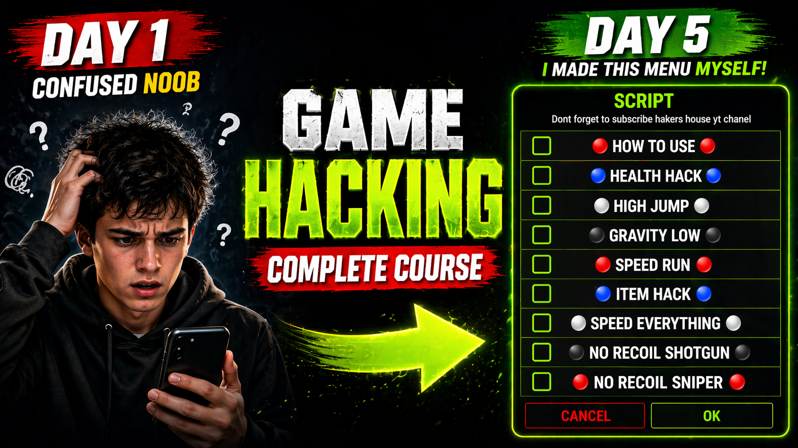

# 🎮 Android Game Hacking With Mobile (Complete Guide)

  

A complete **Android game hacking With Mobile** to learn **game hacking**, memory editing, and scripting using tools like Game Guardian. The unique thing about this cource is you do not need a pc, you hack the game and make scripts cheats entirely in your mobile phone.

This roadmap works as a **game hacking course alternative**, guiding you from beginner to advanced level with real techniques used in **video game hacking**.

---

## 🧠 What You Will Learn

- How **game hacking** works internally
- Memory scanning and value editing
- How to hack coins, health, and game mechanics
- Advanced techniques like pointers, offsets, and scripts
- Using popular **game hack tools** like Game Guardian

---

## 🗺️ Roadmap Overview

🟢 Beginner → 🟡 Intermediate → 🔴 Advanced → ⚫ Expert

This roadmap is designed for anyone who wants to **learn game hacking step-by-step**, especially focused on **Android game hacking**.

---

# 🟢 Phase 1 — Game Hacking Fundamentals

Learn how **video game hacking** works at a memory level.

- [Intro to Game Hacking](https://hackershouse.tech/game-hacking-course/lesson/part-1/chapter/intro-to-game-hacking)

Learn the core workflow used in almost all **game hacking techniques**:

- [Hack Finding](https://hackershouse.tech/game-hacking-course/lesson/part-1/chapter/hack-finding)

Build your first working hack script:

- [Make Script Level 1](https://hackershouse.tech/game-hacking-course/lesson/part-1/chapter/make-script-level-1)

---

# 🟡 Phase 2 — Core Game Hacking Techniques

Learn how to hack common game systems like coins and health.

- [Hack Coins & Gems](https://hackershouse.tech/game-hacking-course/lesson/part-2/chapter/hack-coin-gems)

Understand why some **game hacks fail** (fake values, protection, server-side logic):

- [Fake Coins & Crash Explanation](https://hackershouse.tech/game-hacking-course/lesson/part-2/chapter/game-shows-fake-coins-why)

Learn bypass techniques used in real-world **game hacking**:

- [Bypass Protection](https://hackershouse.tech/game-hacking-course/lesson/part-2/chapter/bypass-protection)

Find unknown values like health using advanced scanning:

- [Health Hack Guide](https://hackershouse.tech/game-hacking-course/lesson/part-2/chapter/health-hack)

---

# 🟠 Phase 3 — Advanced Value Finding & Stability

Improve your **game hacking workflow** by finding stable and related values.

- [Advanced Hack Finding](https://hackershouse.tech/game-hacking-course/lesson/part-2/chapter/advance-hack-finding)

- [Advanced Value Finding](https://hackershouse.tech/game-hacking-course/lesson/part-2/chapter/advance-value-finding)

Organize values into reusable hacks and scripts:

- [Group Search & Value Management](https://hackershouse.tech/game-hacking-course/lesson/part-2/chapter/group-search)

Build more advanced multi-feature scripts:

- [Make Script Level 2](https://hackershouse.tech/game-hacking-course/lesson/part-1/chapter/make-script-level-2)

---

# 🔴 Phase 4 — Gameplay & Combat Hacks

Apply **game hacking techniques** to real gameplay systems.

- [Auto Win Hack](https://hackershouse.tech/game-hacking-course/lesson/part-2/chapter/auto-win-hack-finding)

Weapon and combat hacks:

- [Bullet Rain Hack](https://hackershouse.tech/game-hacking-course/lesson/part-2/chapter/bullet-rain-hack)
- [Unlimited Mag Size](https://hackershouse.tech/game-hacking-course/lesson/part-2/chapter/unlimited-mag-size)

Movement and map hacks:

- [Wallhack](https://hackershouse.tech/game-hacking-course/lesson/part-2/chapter/wallhack-finding)

Advanced targeting systems:

- [Aimbot Tutorial](https://hackershouse.tech/game-hacking-course/lesson/part-2/chapter/aimbot-value-finding)

---

# ⚫ Phase 5 — Advanced Game Hacking (Pointers & Scripts)

Learn deeper memory manipulation techniques used in advanced **Android game hacking**.

- [Pointer Usage](https://hackershouse.tech/game-hacking-course/lesson/part-2/chapter/pointers-uses)

- [Offset & Script Techniques](https://hackershouse.tech/game-hacking-course/lesson/part-2/chapter/offset-script-and-use)

---

# ⚫ Phase 6 — Expert Game Hacking Techniques

Move into advanced workflows used by experienced hackers.

- [Value Explorer Technique](https://hackershouse.tech/game-hacking-course/lesson/part-2/chapter/explore-hacks)

- [Dump & Script Workflow](https://hackershouse.tech/game-hacking-course/lesson/part-2/chapter/dump-hack-script)

---

# 📚 Full Game Hacking Course

If you want a complete structured **game hacking course** with step-by-step lessons:

👉 [Game Hacking Course](https://hackershouse.tech/game-hacking-course)

---

# ⭐ Support

If this roadmap helps you learn **game hacking**, consider starring ⭐
